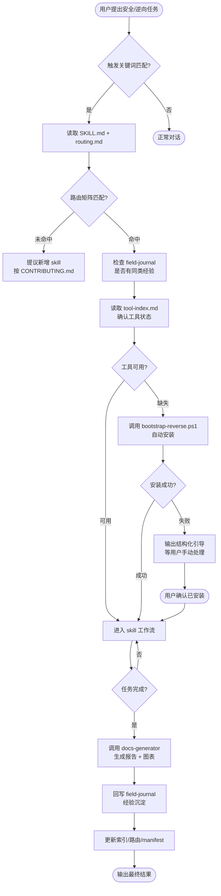
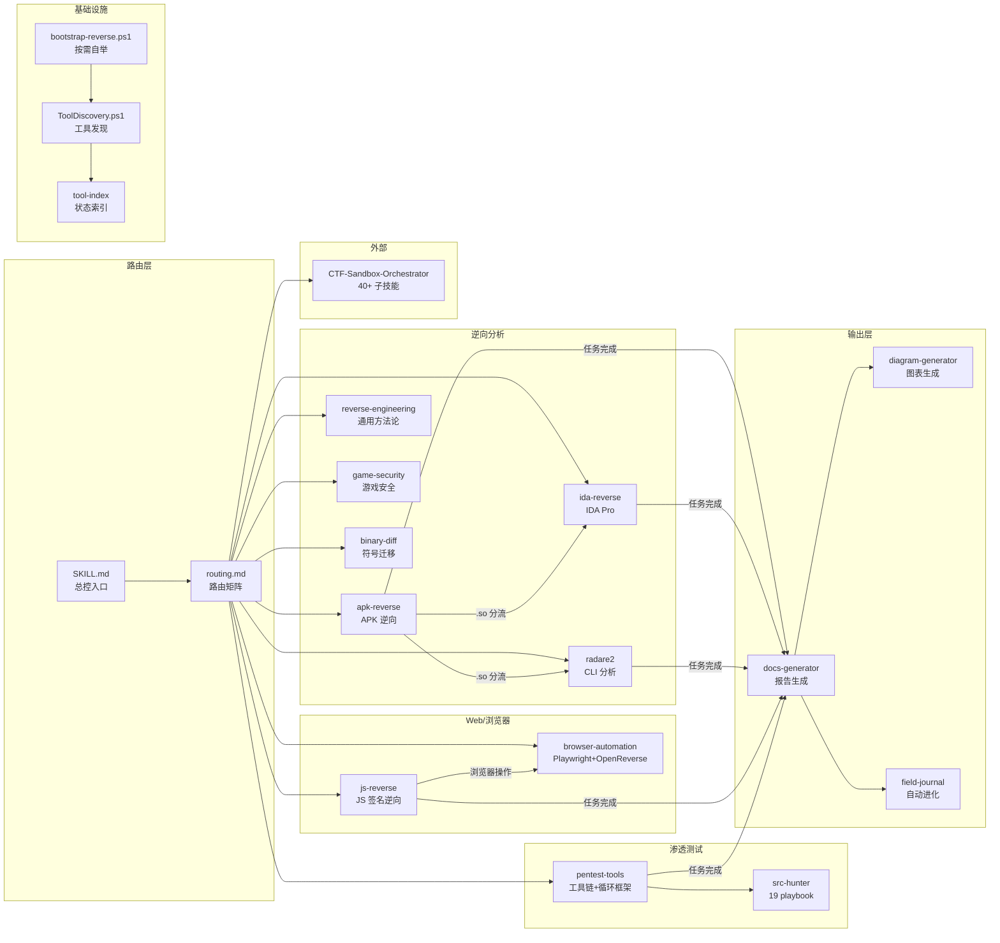
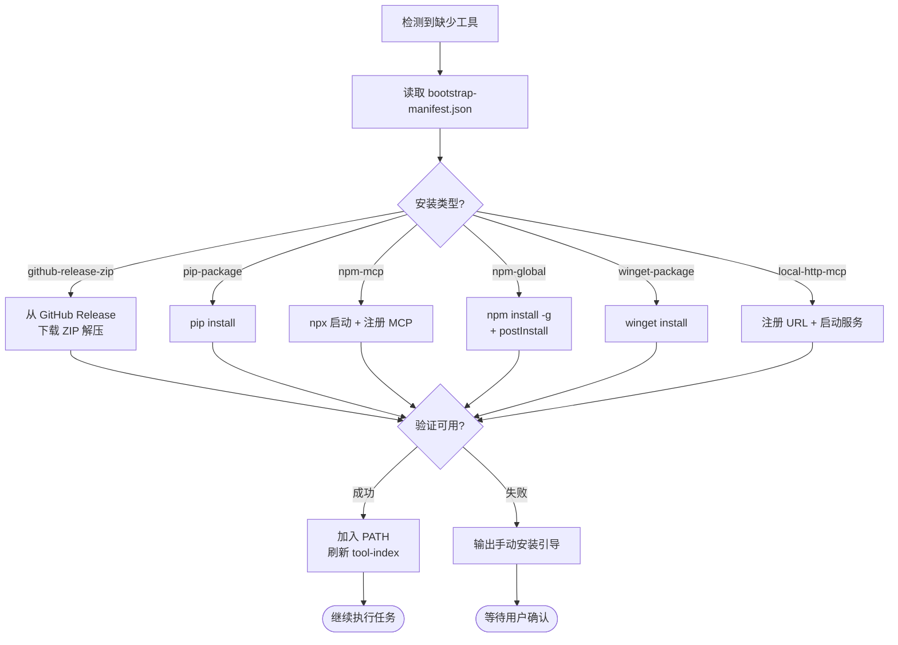
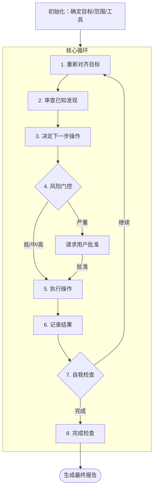
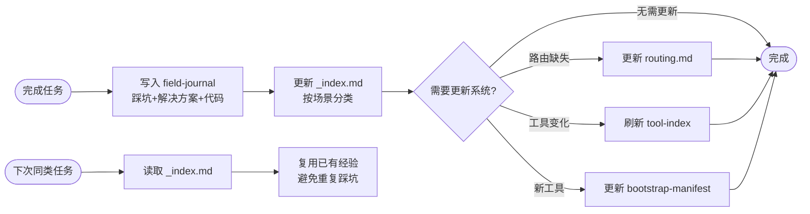

# 系统架构图

## 完整行为链流程图

```mermaid
flowchart TD
    Start([用户提出安全/逆向任务]) --> Detect{触发关键词匹配?}
    Detect -->|是| ReadRouting[读取 SKILL.md + routing.md]
    Detect -->|否| Normal([正常对话])
    
    ReadRouting --> RouteMatch{路由矩阵匹配?}
    RouteMatch -->|未命中| ProposeNew[提议新增 skill<br/>按 CONTRIBUTING.md]
    RouteMatch -->|命中| CheckJournal[检查 field-journal<br/>是否有同类经验]
    
    CheckJournal --> CheckTools[读取 tool-index.md<br/>确认工具状态]
    CheckTools --> ToolOK{工具可用?}
    
    ToolOK -->|缺失| Bootstrap[调用 bootstrap-reverse.ps1<br/>自动安装]
    ToolOK -->|可用| Execute[进入 skill 工作流]
    
    Bootstrap --> BootOK{安装成功?}
    BootOK -->|成功| Execute
    BootOK -->|失败| Guide[输出结构化引导<br/>等用户手动处理]
    Guide --> UserConfirm([用户确认已安装])
    UserConfirm --> Execute
    
    Execute --> TaskDone{任务完成?}
    TaskDone -->|否| Execute
    TaskDone -->|是| GenReport[调用 docs-generator<br/>生成报告 + 图表]
    
    GenReport --> WriteJournal[回写 field-journal<br/>经验沉淀]
    WriteJournal --> UpdateIndex[更新索引/路由/manifest]
    UpdateIndex --> Output([输出最终结果])
```

## Skills 模块关系图

```mermaid
flowchart LR
    subgraph 路由层
        SKILL[SKILL.md<br/>总控入口]
        Routing[routing.md<br/>路由矩阵]
    end

    subgraph 逆向分析
        APK[apk-reverse<br/>APK 逆向]
        IDA[ida-reverse<br/>IDA Pro]
        R2[radare2<br/>CLI 分析]
        RE[reverse-engineering<br/>通用方法论]
        Game[game-security<br/>游戏安全]
        BinDiff[binary-diff<br/>符号迁移]
    end

    subgraph 渗透测试
        Pentest[pentest-tools<br/>工具链+循环框架]
        SrcHunter[src-hunter<br/>19 playbook]
    end

    subgraph Web/浏览器
        JS[js-reverse<br/>JS 签名逆向]
        Browser[browser-automation<br/>Playwright+OpenReverse]
    end

    subgraph 基础设施
        Bootstrap[bootstrap-reverse.ps1<br/>按需自举]
        Discovery[ToolDiscovery.ps1<br/>工具发现]
        ToolIndex[tool-index<br/>状态索引]
    end

    subgraph 输出层
        Docs[docs-generator<br/>报告生成]
        Diagram[diagram-generator<br/>图表生成]
        Journal[field-journal<br/>自动进化]
    end

    subgraph 外部
        CTF[CTF-Sandbox-Orchestrator<br/>40+ 子技能]
    end

    SKILL --> Routing
    Routing --> APK & IDA & R2 & RE & Game & BinDiff
    Routing --> Pentest & JS & Browser
    Routing --> CTF

    Pentest --> SrcHunter
    APK -->|.so 分流| IDA
    APK -->|.so 分流| R2
    JS -->|浏览器操作| Browser
    
    Bootstrap --> Discovery --> ToolIndex
    
    APK & IDA & R2 & Pentest & JS -->|任务完成| Docs
    Docs --> Diagram
    Docs --> Journal
```

## Bootstrap 自举流程

```mermaid
flowchart TD
    Need[检测到缺少工具] --> ReadManifest[读取 bootstrap-manifest.json]
    ReadManifest --> Kind{安装类型?}
    
    Kind -->|github-release-zip| GH[从 GitHub Release<br/>下载 ZIP 解压]
    Kind -->|pip-package| Pip[pip install]
    Kind -->|npm-mcp| NPM[npx 启动 + 注册 MCP]
    Kind -->|npm-global| Global[npm install -g<br/>+ postInstall]
    Kind -->|winget-package| Winget[winget install]
    Kind -->|local-http-mcp| HTTP[注册 URL + 启动服务]
    
    GH & Pip & NPM & Global & Winget & HTTP --> Verify{验证可用?}
    Verify -->|成功| AddPath[加入 PATH<br/>刷新 tool-index]
    Verify -->|失败| Manual[输出手动安装引导]
    
    AddPath --> Continue([继续执行任务])
    Manual --> Wait([等待用户确认])
```

## 渗透测试循环

```mermaid
flowchart TD
    Init[初始化：确定目标/范围/工具] --> Loop

    subgraph Loop[核心循环]
        Align[1. 重新对齐目标] --> Review[2. 审查已知发现]
        Review --> Decide[3. 决定下一步操作]
        Decide --> Risk{4. 风险门控}
        Risk -->|低/中/高| Exec[5. 执行操作]
        Risk -->|严重| Ask[请求用户批准]
        Ask -->|批准| Exec
        Exec --> Record[6. 记录结果]
        Record --> Check{7. 自我检查}
        Check -->|继续| Align
        Check -->|完成| Done
    end

    Done[8. 完成检查] --> Report([生成最终报告])
```

## 自动进化机制

```mermaid
flowchart LR
    Task([完成任务]) --> WriteLog[写入 field-journal<br/>踩坑+解决方案+代码]
    WriteLog --> UpdateIdx[更新 _index.md<br/>按场景分类]
    UpdateIdx --> CheckUpdate{需要更新系统?}
    
    CheckUpdate -->|路由缺失| FixRoute[更新 routing.md]
    CheckUpdate -->|工具变化| FixTool[刷新 tool-index]
    CheckUpdate -->|新工具| FixManifest[更新 bootstrap-manifest]
    CheckUpdate -->|无需更新| Done([完成])
    
    FixRoute & FixTool & FixManifest --> Done

    NewTask([下次同类任务]) --> ReadIdx[读取 _index.md]
    ReadIdx --> Reuse[复用已有经验<br/>避免重复踩坑]
```
